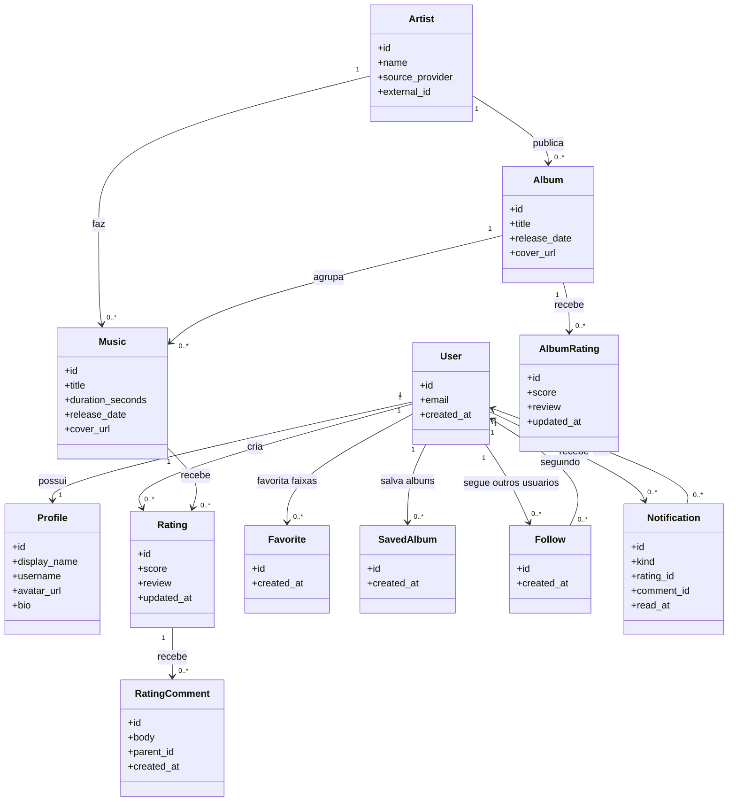
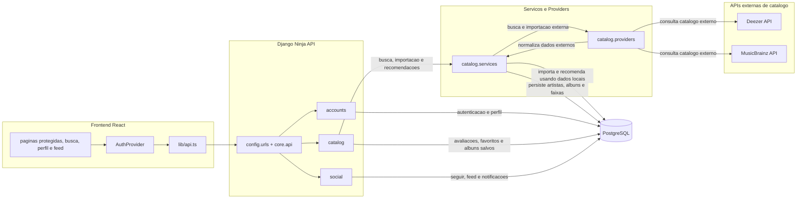

# Palhinha

Este projeto tem como objetivo criar um sistema de avaliação musical, onde os usuários podem avaliar músicas e compartilhar suas opiniões.

## Colaboradores

- [Júlia Borba](https://github.com/juliaborbaf) - Full Stack Developer
- [Laura Froede](https://github.com/laurafroede) - Full Stack Developer
- [Natanael Júnior](https://github.com/natanaelo-jr) - Full Stack Developer
- [Rafael Sant'ana](https://github.com/rafael-sant-ana) - Full Stack Developer

## Objetivos

Viabilizar a integração de um sistema de avaliação musical, onde os usuários possam avaliar músicas e compartilhar suas opiniões. O projeto visa criar uma plataforma interativa e fácil de usar, permitindo que os usuários descubram novas músicas e compartilhem suas experiências musicais com outros. Os usuários devem ser capazes de criar perfis, avaliar músicas e álbuns, deixar comentários e interagir com outros usuários. O sistema deve ser intuitivo e responsivo, proporcionando uma experiência agradável para os usuários. Além disso, o projeto deve incluir recursos de segurança para proteger as informações dos usuários e garantir a integridade do sistema.

## Tecnologias Utilizadas

- Front-end: React, HTML, CSS
- Back-end: Django Ninja
- Banco de Dados: PostgreSQL
- Autenticação: JWT (JSON Web Tokens), OAuth
- AI Agents: Claude Code, Codex, Antigravity, Copilot ...(A definir)

## User Stories

- Como usuário, quero selecionar o idioma da minha preferência.
- Como usuário, quero criar um perfil para que eu possa personalizar minha experiência na plataforma.
- Como usuário, quero pesquisar por músicas e álbuns para encontrar minhas músicas favoritas.
- Como usuário, quero avaliar músicas e álbuns com nota e review para compartilhar minhas opiniões com outros usuários.
- Como usuário, quero seguir outros usuários para acompanhar suas avaliações e descobertas musicais.
- Como usuário, quero poder definir minhas músicas e álbuns favoritos para expô-los em meu perfil.
- Como usuário, quero responder a avaliações de outros usuários para interagir e compartilhar minhas opiniões.
- Como usuário, quero receber recomendações de músicas com base nas minhas avaliações e preferências para descobrir novas músicas.
- Como usuário, quero ser notificado sobre novas avaliações e comentários em minhas avaliações para acompanhar as interações com outros usuários.
- Como moderador, quero ter acesso a ferramentas de moderação para garantir que as avaliações e comentários sejam apropriados e respeitosos.
- Como administrador, quero ter acesso a um painel de controle para gerenciar usuários, avaliações e comentários, garantindo a integridade e segurança da plataforma.

## Setup do Projeto

### 1. Pré-requisitos

Certifique-se de ter instalado:

- Python 3.11+
- Node.js (18+)
- Docker + Docker Compose
- uv
- pipx
- just

---

### 2. Clonar o repositório

```bash
git clone https://github.com/natanaelo-jr/musical-rater.git
cd musical-rater
```

---

### 3. Configurar variáveis de ambiente

Crie um arquivo `.env` na raiz seguindo o `.env.example`:

```env
# Backend
DEBUG=True
SECRET_KEY=your-secret-key

# Database
POSTGRES_DB=musical_rater
POSTGRES_USER=postgres
POSTGRES_PASSWORD=postgres
POSTGRES_HOST=localhost
POSTGRES_PORT=5432
```

---

### 4. Criar o Banco de Dados com Docker

```bash
docker compose up -d
```

### 5. Backend (Django Ninja)

```bash
cd backend

uv sync
uv run python manage.py migrate

```

---

### 6. Frontend (React)

```bash
cd frontend

pnpm install
```

---

### 7. Pre-commit (lint + formatter)

```bash
pipx install pre-commit
pre-commit install
pre-commit run --all-files
```

---

### 8. Rodar o projeto (modo desenvolvimento)

```bash
just dev
```

---

## ⚙️ Comandos úteis

```bash
just dev          # sobe frontend + backend
just backend      # roda apenas backend
just frontend     # roda apenas frontend
just migrate      # roda migrations
just lint         # roda linters manualmente
```

---

## 🧠 Observações

- O projeto utiliza:
  - Ruff (backend)
  - ESLint + Prettier (frontend)
- Hooks de commit são gerenciados via pre-commit
- O CI valida automaticamente lint e formatação

## Documentação

- [Schema do banco de dados](docs/database-schema.md)

## Diagramas UML

### Diagrama de Classes



O diagrama acima resume o modelo do projeto. Os atributos foram reduzidos aos campos que explicam comportamento, identidade e ligacoes principais entre entidades.

### Diagrama de Pacotes



O fluxo parte do React, passa por `AuthProvider` e `lib/api.ts`, e entra nas rotas expostas por `config.urls` e `core.api`.
No backend, `accounts`, `catalog` e `social` separam responsabilidades; a logica de importacao e recomendacao fica concentrada em `catalog.services`.
As APIs externas usadas hoje sao `Deezer` e `MusicBrainz`; `catalog.providers` consulta essas fontes, normaliza os metadados e alimenta o catalogo local em PostgreSQL.
Depois da importacao, o catalogo local vira a base usada nas avaliacoes, no feed social e nas notificacoes.
