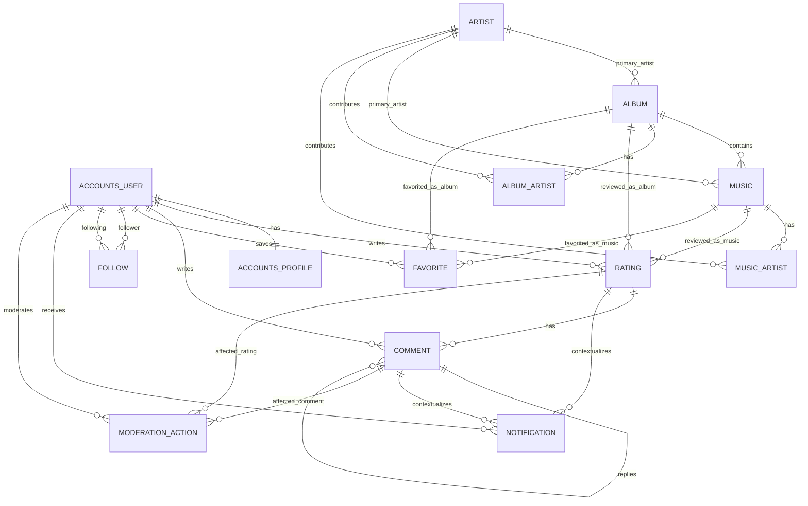

# Database Schema

Este documento descreve a proposta inicial de schema relacional para o Musical Rater. O desenho considera PostgreSQL em producao e Django ORM no backend.

## Escopo

O schema cobre as historias principais do produto:

- usuarios com perfil publico;
- catalogo de artistas, albuns e musicas;
- avaliacoes com nota e review;
- comentarios e respostas;
- favoritos;
- seguidores;
- notificacoes;
- moderacao basica.

## Entidades Principais

### accounts_user

Usuario autenticado do sistema. Ja existe como `accounts.User`.

| Campo | Tipo | Regras |
| --- | --- | --- |
| id | bigserial PK | Identificador interno |
| email | varchar unique | Login principal |
| password | varchar | Hash gerenciado pelo Django |
| is_active | boolean | Controle de acesso |
| is_staff | boolean | Acesso administrativo |
| is_superuser | boolean | Permissoes globais |
| created_at | timestamptz | Criacao |
| updated_at | timestamptz | Atualizacao |

### accounts_profile

Perfil publico do usuario. Ja existe como `accounts.Profile`.

| Campo | Tipo | Regras |
| --- | --- | --- |
| id | bigserial PK | Identificador interno |
| user_id | FK accounts_user unique | Relacao 1:1 com usuario |
| display_name | varchar(120) | Nome exibido |
| username | varchar(30) unique nullable | Identificador publico |
| avatar_url | url | Avatar externo |
| bio | varchar(280) | Bio curta |
| created_at | timestamptz | Criacao |
| updated_at | timestamptz | Atualizacao |

### artist

Representa artistas, bandas, grupos ou compositores cadastrados.

| Campo | Tipo | Regras |
| --- | --- | --- |
| id | bigserial PK | Identificador interno |
| name | varchar(255) | Obrigatorio |
| slug | varchar(255) unique | URL amigavel |
| image_url | url nullable | Foto/capa |
| bio | text blank | Descricao |
| country | varchar(2) nullable | ISO 3166-1 alpha-2 |
| external_id | varchar(255) nullable | ID de provedor externo |
| created_at | timestamptz | Criacao |
| updated_at | timestamptz | Atualizacao |

### album

Agrupa musicas em um lancamento.

| Campo | Tipo | Regras |
| --- | --- | --- |
| id | bigserial PK | Identificador interno |
| title | varchar(255) | Obrigatorio |
| slug | varchar(255) | Unico por artista principal |
| primary_artist_id | FK artist | Artista principal |
| release_date | date nullable | Data de lancamento |
| cover_url | url nullable | Capa |
| album_type | enum | `album`, `single`, `ep`, `compilation`, `live`, `soundtrack` |
| external_id | varchar(255) nullable | ID de provedor externo |
| created_at | timestamptz | Criacao |
| updated_at | timestamptz | Atualizacao |

Constraints recomendadas: `unique(primary_artist_id, slug)` e indice em `title`.

### music

Faixa avaliavel individualmente.

| Campo | Tipo | Regras |
| --- | --- | --- |
| id | bigserial PK | Identificador interno |
| title | varchar(255) | Obrigatorio |
| slug | varchar(255) | Unico por album quando houver album |
| album_id | FK album nullable | Album de origem |
| primary_artist_id | FK artist | Artista principal |
| track_number | integer nullable | Numero da faixa |
| duration_seconds | integer nullable | Duracao em segundos |
| explicit | boolean | Conteudo explicito |
| external_id | varchar(255) nullable | ID de provedor externo |
| created_at | timestamptz | Criacao |
| updated_at | timestamptz | Atualizacao |

Constraints recomendadas: `duration_seconds >= 0`, `track_number > 0`, `unique(album_id, track_number)` quando `track_number` nao for nulo.

### album_artist

Relaciona albuns com artistas participantes.

| Campo | Tipo | Regras |
| --- | --- | --- |
| id | bigserial PK | Identificador interno |
| album_id | FK album | Obrigatorio |
| artist_id | FK artist | Obrigatorio |
| role | enum | `primary`, `featured`, `producer`, `composer` |

Constraint recomendada: `unique(album_id, artist_id, role)`.

### music_artist

Relaciona musicas com artistas participantes.

| Campo | Tipo | Regras |
| --- | --- | --- |
| id | bigserial PK | Identificador interno |
| music_id | FK music | Obrigatorio |
| artist_id | FK artist | Obrigatorio |
| role | enum | `primary`, `featured`, `producer`, `composer` |

Constraint recomendada: `unique(music_id, artist_id, role)`.

### rating

Review e nota feita por usuario para musica ou album.

| Campo | Tipo | Regras |
| --- | --- | --- |
| id | bigserial PK | Identificador interno |
| user_id | FK accounts_user | Autor |
| music_id | FK music nullable | Alvo musica |
| album_id | FK album nullable | Alvo album |
| score | numeric(3,1) | 0.0 a 5.0 |
| review | text blank | Texto da review |
| visibility | enum | `public`, `followers`, `private` |
| status | enum | `active`, `hidden`, `deleted` |
| created_at | timestamptz | Criacao |
| updated_at | timestamptz | Atualizacao |

Constraints recomendadas:

- exatamente um alvo preenchido: `music_id` ou `album_id`;
- `score >= 0` e `score <= 5`;
- `unique(user_id, music_id)` quando `music_id` nao for nulo;
- `unique(user_id, album_id)` quando `album_id` nao for nulo.

### comment

Comentario em uma avaliacao, com suporte a respostas.

| Campo | Tipo | Regras |
| --- | --- | --- |
| id | bigserial PK | Identificador interno |
| rating_id | FK rating | Avaliacao comentada |
| user_id | FK accounts_user | Autor |
| parent_id | FK comment nullable | Resposta a outro comentario |
| body | text | Obrigatorio |
| status | enum | `active`, `hidden`, `deleted` |
| created_at | timestamptz | Criacao |
| updated_at | timestamptz | Atualizacao |

Indice recomendado: `(rating_id, created_at)`.

### follow

Relacao social de seguir outro usuario.

| Campo | Tipo | Regras |
| --- | --- | --- |
| id | bigserial PK | Identificador interno |
| follower_id | FK accounts_user | Quem segue |
| following_id | FK accounts_user | Quem e seguido |
| created_at | timestamptz | Criacao |

Constraints recomendadas: `unique(follower_id, following_id)` e `follower_id != following_id`.

### favorite

Musicas e albuns favoritos exibidos no perfil.

| Campo | Tipo | Regras |
| --- | --- | --- |
| id | bigserial PK | Identificador interno |
| user_id | FK accounts_user | Dono do favorito |
| music_id | FK music nullable | Musica favoritada |
| album_id | FK album nullable | Album favoritado |
| position | integer nullable | Ordem no perfil |
| created_at | timestamptz | Criacao |

Constraints recomendadas:

- exatamente um alvo preenchido: `music_id` ou `album_id`;
- `position > 0` quando preenchida;
- `unique(user_id, music_id)` quando `music_id` nao for nulo;
- `unique(user_id, album_id)` quando `album_id` nao for nulo.

### notification

Eventos enviados ao usuario.

| Campo | Tipo | Regras |
| --- | --- | --- |
| id | bigserial PK | Identificador interno |
| recipient_id | FK accounts_user | Usuario notificado |
| actor_id | FK accounts_user nullable | Usuario que gerou o evento |
| type | enum | `new_rating`, `new_comment`, `reply`, `follow`, `moderation` |
| rating_id | FK rating nullable | Contexto opcional |
| comment_id | FK comment nullable | Contexto opcional |
| read_at | timestamptz nullable | Data de leitura |
| created_at | timestamptz | Criacao |

Indice recomendado: `(recipient_id, read_at, created_at)`.

### moderation_action

Registro auditavel de acoes de moderacao.

| Campo | Tipo | Regras |
| --- | --- | --- |
| id | bigserial PK | Identificador interno |
| moderator_id | FK accounts_user | Moderador |
| target_user_id | FK accounts_user nullable | Usuario afetado |
| rating_id | FK rating nullable | Review afetada |
| comment_id | FK comment nullable | Comentario afetado |
| action | enum | `hide`, `restore`, `delete`, `warn`, `ban` |
| reason | text | Justificativa |
| created_at | timestamptz | Criacao |

## Relacionamentos

- `User` possui um `Profile`.
- `User` cria muitas `Rating`, `Comment`, `Favorite`, `Notification` e `ModerationAction`.
- `User` segue muitos outros usuarios por meio de `Follow`.
- `Artist` participa de muitos `Album` e `Music`.
- `Album` pertence a um artista principal e pode ter muitos artistas participantes.
- `Album` contem muitas `Music`.
- `Music` pertence a um artista principal e pode ter muitos artistas participantes.
- `Rating` pertence a um usuario e avalia exatamente uma musica ou um album.
- `Comment` pertence a uma avaliacao e pode responder outro comentario.
- `Favorite` pertence a um usuario e aponta exatamente para uma musica ou album.
- `Notification` pertence ao usuario destinatario e pode referenciar o ator e o conteudo relacionado.
- `ModerationAction` registra a acao de um moderador sobre usuario, avaliacao ou comentario.

## ER Diagram

## Regras de Negocio

- Um usuario pode avaliar a mesma musica uma unica vez.
- Um usuario pode avaliar o mesmo album uma unica vez.
- Uma avaliacao deve apontar para musica ou album, nunca ambos.
- Comentarios devem estar associados a uma avaliacao.
- Uma resposta deve pertencer a mesma avaliacao do comentario pai.
- Usuarios nao podem seguir a si mesmos.
- Favoritos devem apontar para musica ou album, nunca ambos.
- Conteudos removidos por moderacao devem preservar auditoria por `status` antes de exclusao fisica.
- O catalogo deve aceitar IDs externos para futura integracao com provedores musicais.

## Ordem Sugerida de Implementacao

1. Configurar PostgreSQL no Django usando as variaveis do `.env`.
2. Criar app `catalog` com `Artist`, `Album`, `Music`, `AlbumArtist` e `MusicArtist`.
3. Criar app `reviews` com `Rating` e `Comment`.
4. Criar app `social` com `Follow`, `Favorite` e `Notification`.
5. Criar app `moderation` com `ModerationAction`.
6. Adicionar migrations e indices.
7. Criar testes para constraints criticas.
8. Revisar o schema com a equipe antes de popular dados reais.

## Checklist de Revisao com Stakeholders

- Confirmar escala de nota: proposta atual usa `0.0` a `5.0` com uma casa decimal.
- Confirmar se albuns e musicas serao importados de provedor externo ou cadastrados manualmente.
- Confirmar se comentarios terao respostas em multiplos niveis ou apenas uma camada.
- Confirmar politica de privacidade para avaliacoes `followers` e `private`.
- Confirmar se favoritos terao limite de exibicao no perfil.
- Confirmar quais eventos geram notificacao no MVP.
- Confirmar fluxo de moderacao: esconder, restaurar, deletar, advertir e banir.
